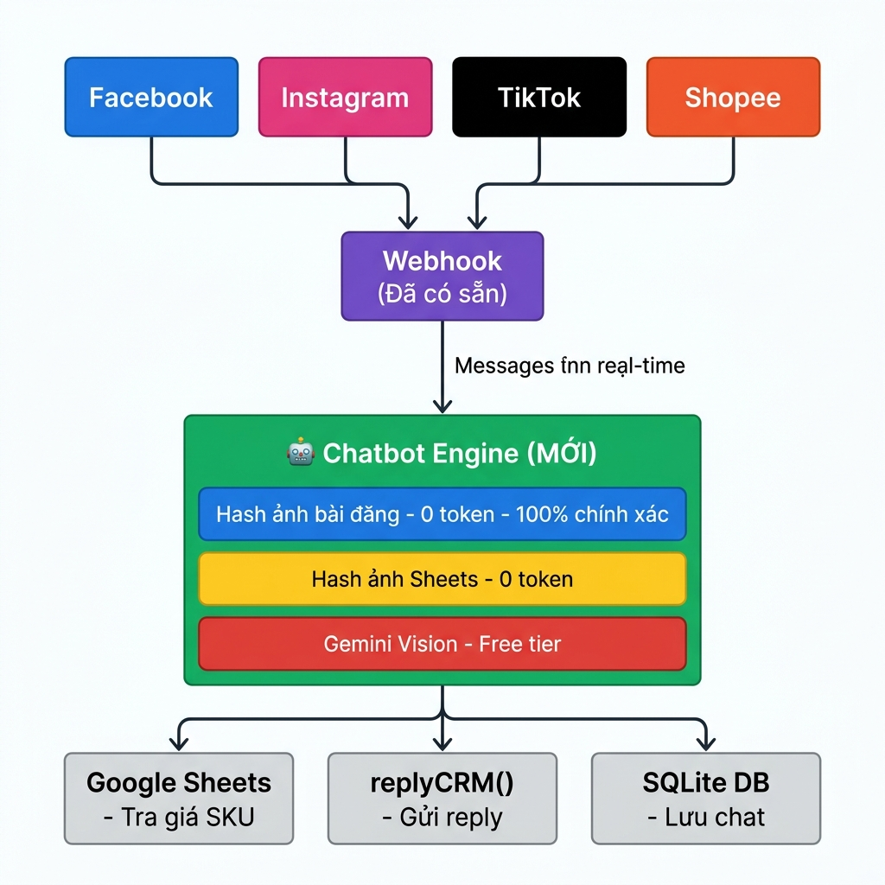
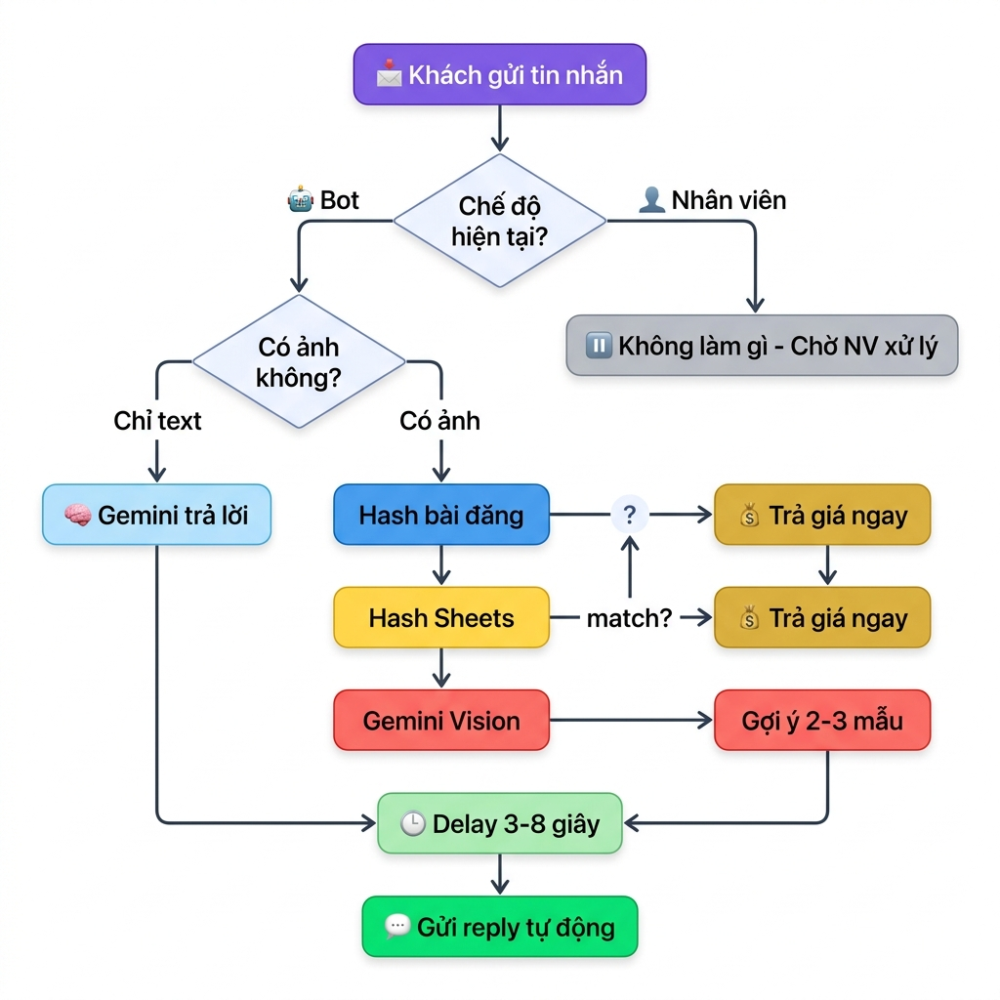
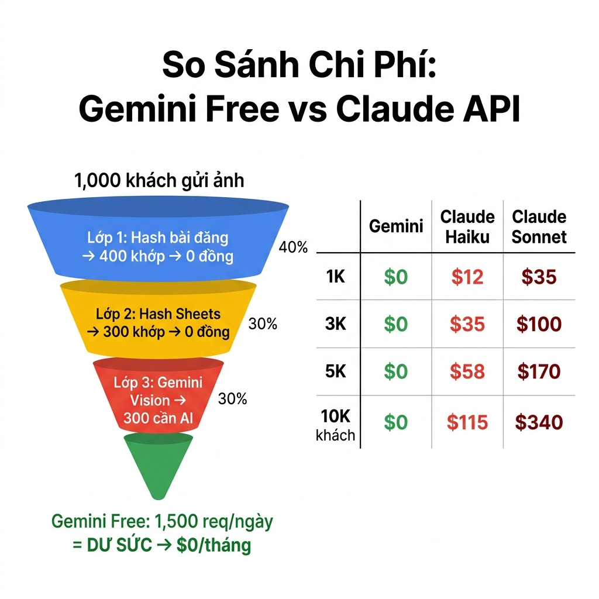

# Chatbot AI Tư Vấn Đồng Hồ — Kế Hoạch Thực Tế

---

## Bạn Đã Có Gì?

> **Dự án watch-auto-publisher đã có 80% hạ tầng. Chỉ cần thêm 2 file mới.**

### ✅ Backend — Đã có sẵn

| Module | File | Chức năng |
|--------|------|-----------|
| Webhook FB | `webhook.routes.js` | Nhận tin nhắn Facebook real-time |
| Webhook IG | `webhook.routes.js` | Nhận tin nhắn Instagram real-time |
| Reply inbox | `crm.service.js` → `replyCRM()` | Gửi trả lời tự động |
| Reply comment | `crm.service.js` → `replyCRM()` | Trả lời bình luận |
| Database CRM | `crm.db.js` (SQLite) | Lưu conversations, messages |
| SSE Broadcast | `broadcastCRM()` | Push real-time lên frontend |
| Multi-account | `accounts.json` | Nhiều tài khoản FB/IG |
| Auto-tag | `autotag.service.js` | Gắn tag khách tự động |
| Google Sheets | `sheet.service.js` | Tra SKU, giá 1000+ sản phẩm |
| Gemini Key | `.env` | Đã có API key |
| Redis Cloud | Upstash | Queue + state |

### ✅ Frontend — Đã có sẵn

| Module | File | Chức năng |
|--------|------|-----------|
| Inbox CRM | `InboxCRM.jsx` | UI chat đầy đủ |
| Dashboard | `Dashboard.jsx` | Tổng quan |
| Workflow | `Workflow.jsx` | Quản lý luồng đăng bài |

### ❌ Cần Thêm — Chỉ 2 file mới + sửa 2 file

| File | Loại | Mô tả |
|------|------|-------|
| `chatbot.service.js` | **MỚI** | Logic bot: nhận tin → xử lý → reply |
| `image-hash.service.js` | **MỚI** | 3 lớp nhận diện ảnh đồng hồ |
| `webhook.routes.js` | SỬA | Thêm ~10 dòng gọi chatbot |
| `InboxCRM.jsx` | SỬA | Thêm badge 🤖Bot / 👤Nhân viên + nút chuyển |

---

## Kiến Trúc Hệ Thống

Chatbot tích hợp trực tiếp vào hệ thống hiện tại:
- **Nền tảng MXH** (Facebook, Instagram, TikTok, Shopee) gửi tin nhắn qua **Webhook**
- **Chatbot Engine** (mới) xử lý tin nhắn qua 3 lớp nhận diện ảnh
- **Services có sẵn** (Google Sheets, replyCRM, SQLite) hỗ trợ tra giá và gửi reply

---

## Flow Xử Lý Tin Nhắn

**Khi khách gửi tin nhắn:**

1. Kiểm tra chế độ: **🤖 Bot** hay **👤 Nhân viên**?
2. Nếu Bot + có ảnh → Chạy 3 lớp nhận diện:
   - **Lớp 1** (xanh): So hash ảnh bài đăng → Khớp = trả giá ngay (0 token AI)
   - **Lớp 2** (vàng): So hash ảnh Sheets → Khớp = trả giá ngay (0 token AI)
   - **Lớp 3** (đỏ): Gemini Vision → Gợi ý 2-3 mẫu (dùng free tier)
3. Nếu Bot + chỉ text → Gemini trả lời (kèm knowledge base của shop)
4. Delay 3-8 giây cho tự nhiên → Gửi reply tự động

---

## Chuyển Chế Độ Bot ↔ Nhân Viên

| Tình huống | Xử lý |
|---|---|
| Khách nhắn → chưa ai reply | ✅ Bot tự trả lời |
| Nhân viên reply 1 tin | ⏸️ Bot **DỪNG** cho đoạn chat đó |
| Nhân viên tiếp tục chat | ⏸️ Bot vẫn dừng |
| Nhân viên im **2 giờ** | 🔄 Bot kích hoạt lại |
| Nhân viên bấm "Giao lại cho Bot" | 🔄 Bot kích hoạt lại ngay |

---

## Chi Phí: $0/tháng

### Tại sao Gemini Free chứ không phải Claude?

Hệ thống **3 lớp nhận diện ảnh** giảm 70% số lần cần gọi AI:

| | 1,000 ảnh từ khách |
|---|---|
| 🔵 Lớp 1: Hash bài đăng | ~400 khớp ngay → **0 token AI** |
| 🟡 Lớp 2: Hash Sheets | ~300 khớp → **0 token AI** |
| 🔴 Lớp 3: Gemini Vision | ~300 cần AI → **Gemini Free dư sức** |

> Gemini Free cho phép **1,500 request/ngày = 45,000/tháng** → Dư sức cho 10,000 khách!

---

### So sánh chi phí hàng tháng

| Quy mô | **Gemini Free** (dự án này) | **Claude Haiku** | **Claude Sonnet** |
|---|---|---|---|
| 1,000 khách/tháng | **$0** | $12 (300K VND) | $35 (875K VND) |
| 3,000 khách/tháng | **$0** | $35 (875K VND) | $100 (2.5M VND) |
| 5,000 khách/tháng | **$0** | $58 (1.45M VND) | $170 (4.25M VND) |
| 10,000 khách/tháng | **$0** | $115 (2.9M VND) | $340 (8.5M VND) |

---

## Tổng Chi Phí So Sánh

### 💸 Theo video (Lovable + Claude + Hostinger) — 3,000 khách/tháng

| Hạng mục | Lần đầu | Hàng tháng |
|----------|---------|-----------|
| Lovable Pro | $25-50 | $0 (sau khi export) |
| Hostinger VPS | — | $6-25 |
| Claude API | — | $35-100 |
| **TỔNG** | **$25-50** | **$41-125/tháng = 1M-3.1M VND** |

### ✅ Dự án của bạn (Gemini + Stack có sẵn)

| Hạng mục | Lần đầu | Hàng tháng |
|----------|---------|-----------|
| Lovable | Không cần (tự code) | $0 |
| Hosting | Chạy trên máy local | $0 |
| Gemini API | Đã có key | $0 (free tier) |
| Redis | Upstash đã có | $0 |
| **TỔNG** | **$0** | **$0/tháng = 0 VND 🎉** |

---

## Nền Tảng MXH — Lộ Trình

| Nền tảng | Trạng thái | Chatbot AI |
|----------|-----------|-----------|
| **Facebook Messenger** | 🟢 Sẵn sàng | ✅ Tích hợp ngay |
| **Instagram DM** | 🟢 Sẵn sàng | ✅ Tích hợp ngay |
| **Facebook Comments** | 🟢 Sẵn sàng | ✅ Bot reply comment |
| **Instagram Comments** | 🟢 Sẵn sàng | ✅ Bot reply comment |
| **TikTok** | 🟡 Chờ API mở | ⬜ Thêm webhook mới |
| **Shopee** | 🟡 Chờ API mở | ⬜ Thêm webhook mới |

> Khi TikTok/Shopee mở API → chỉ thêm webhook route mới → gọi cùng `chatbot.service.js`. **Logic bot dùng chung tất cả nền tảng.**

---

## Việc Cần Làm

| # | Task | Thời gian |
|---|------|-----------|
| 1 | Tạo `chatbot.service.js` — Logic bot chính | ~1-2 ngày |
| 2 | Tạo `image-hash.service.js` — 3 lớp nhận diện ảnh | ~1 ngày |
| 3 | Sửa `webhook.routes.js` — Thêm ~10 dòng code | ~30 phút |
| 4 | Sửa `InboxCRM.jsx` — Badge + nút chuyển chế độ | ~2-3 giờ |
| 5 | Viết `chatbot-knowledge.md` — Nội dung shop | Do bạn cung cấp |
| 6 | Test + fine-tune | ~1-2 ngày |

> **Tổng: ~4-5 ngày · Chi phí: $0 · Lên đến 10,000 khách/tháng miễn phí.**
