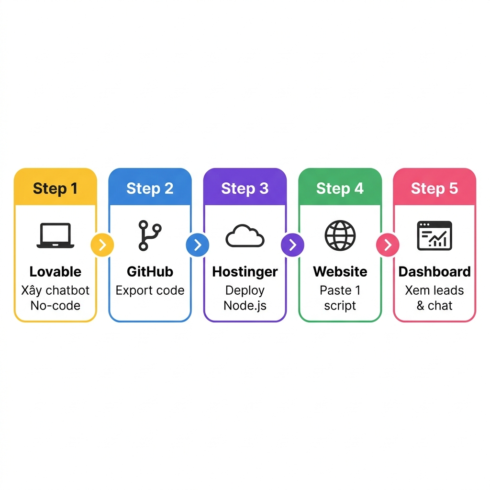
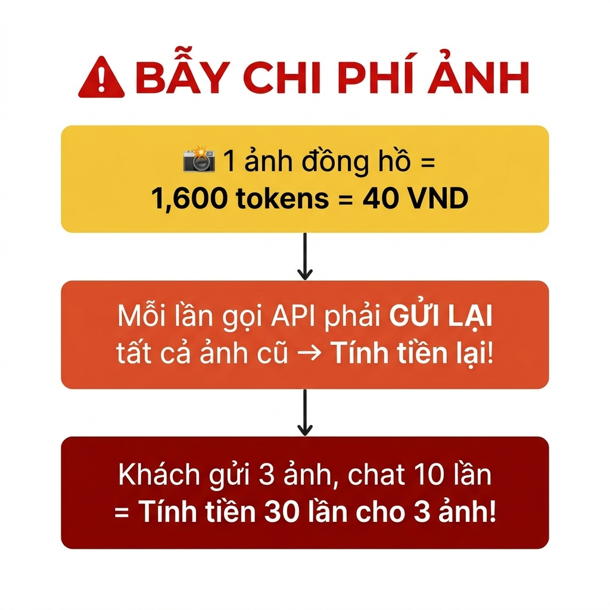
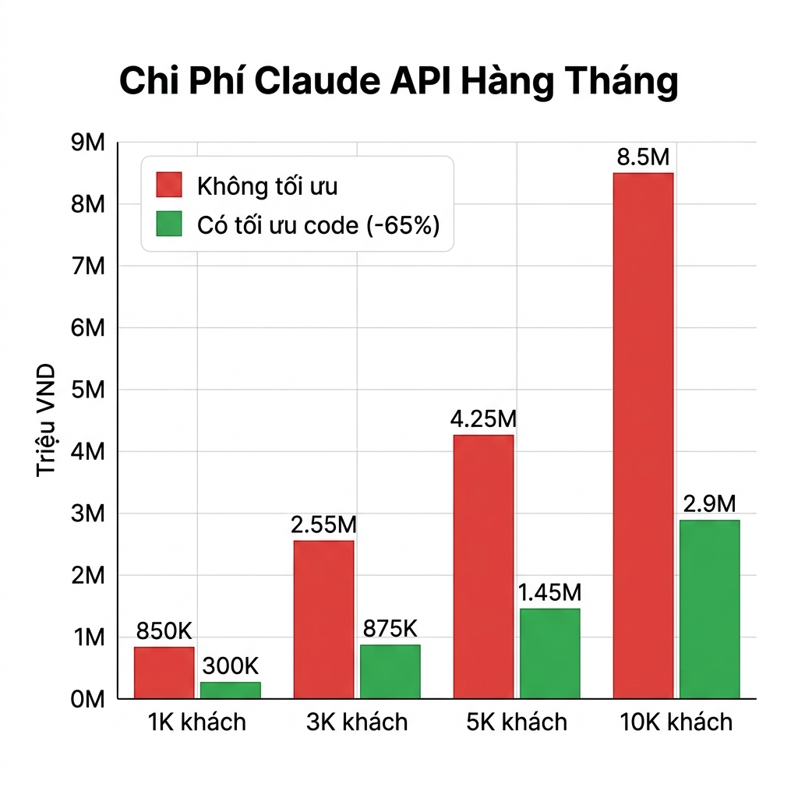
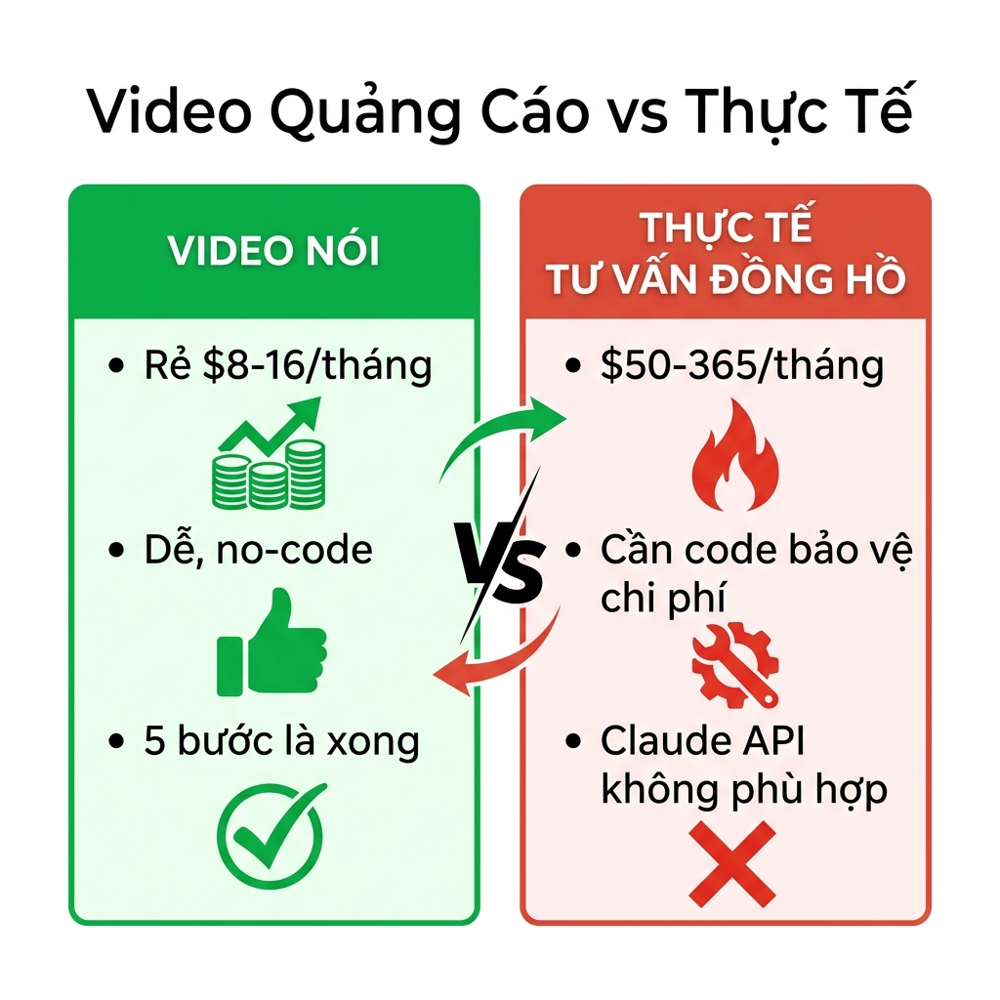

# Phân Tích Video: AI Chatbot — Lovable + Claude + Hostinger

---

## Video Nói Gì?

Video hướng dẫn tạo **AI Chatbot hỗ trợ khách hàng** cho website, dùng công cụ no-code, deploy lên hosting giá rẻ.

### Quy trình 5 bước

| Bước | Công cụ | Làm gì |
|------|---------|--------|
| 1 | **Lovable** | Mô tả bằng lời → Lovable tự sinh code chatbot (React + Node.js) |
| 2 | **GitHub** | Export code từ Lovable lên GitHub |
| 3 | **Hostinger** | Thuê hosting, deploy ứng dụng Node.js |
| 4 | **Website** | Copy/paste 1 đoạn script vào web bất kỳ → chatbot hiện lên |
| 5 | **Dashboard** | Xem lịch sử chat, leads, analytics |

---

## 3 Thành Phần & Giá Tiền

### 🧱 Lovable — Xây chatbot không cần code

| Gói | Giá | Credits | Ghi chú |
|-----|------|---------|---------|
| Free | **$0** | 5/ngày | Thử nghiệm |
| Pro | **$25/tháng** | 100/tháng | Đủ cho 1 dự án |
| Business | **$50/tháng** | Nhiều hơn | Team features |

> 💡 Chỉ cần trả tiền **lúc xây dựng**. Export code xong → hủy subscription → **$0** sau đó.

---

### 🤖 Claude API — AI trả lời khách

| Model | Giá gửi đi (Input) | Giá trả về (Output) | Dùng cho |
|-------|---------------------|---------------------|----------|
| **Haiku** | $1 / 1 triệu token | **$5 / 1 triệu token** | Rẻ nhất, nhanh |
| **Sonnet** | $3 / 1 triệu token | **$15 / 1 triệu token** | Cân bằng |
| **Opus** | $5 / 1 triệu token | **$25 / 1 triệu token** | Đắt nhất |

> ⚠️ **Output đắt gấp 5 lần input.** Mỗi lần gọi API tính tiền **cả 2 chiều** (gửi đi + trả về).

---

### ☁️ Hostinger — Hosting

| Gói | Giá KM | Giá gia hạn |
|-----|--------|-------------|
| Business Web | ~$3.99/tháng | **~$8.99/tháng** |
| VPS KVM 1 | ~$6.49/tháng | **~$11.99/tháng** |
| VPS KVM 2 | ~$10.49/tháng | **~$17.99/tháng** |

> ⚠️ Giá quảng cáo cho hợp đồng **24-48 tháng**. Giá gia hạn thường **gấp đôi**!

---

## Chi Phí Ẩn — Bài Toán Tư Vấn Đồng Hồ

### 📸 Ảnh = Kẻ giết chi phí thầm lặng

**1 ảnh đồng hồ = 1,600 tokens = 40 VND (Haiku).** Và mỗi lần khách gửi tin nhắn mới, **tất cả ảnh cũ phải được gửi lại** cho AI → tính tiền lại!

Ví dụ: Khách gửi 3 ảnh, chat qua lại 10 lần = tính tiền 3 ảnh đó **10 lần** = 30 lần tính phí ảnh!

---

### 👤 4 loại khách hàng thực tế

| Loại khách | Tỷ lệ | Ảnh gửi | Số tin nhắn | Chi phí/khách (Haiku) |
|------------|--------|---------|-------------|----------------------|
| 💬 Hỏi nhanh (hỏi giá rồi đi) | 40% | 1-2 | 4-6 | **225 VND** |
| 🔍 Hỏi kỹ (so sánh, bảo hành) | 30% | 3-5 | 10-15 | **675 VND** |
| 🗣️ Buôn chuyện (mặc cả, hỏi dài) | 20% | 5-8 | 20-30 | **1,700 VND** |
| 🤪 Spam / rảnh (chat cho vui) | 10% | 0-2 | 30-50+ | **2,250 VND** |

---

### 💰 Tổng chi phí Claude API theo quy mô

| Quy mô | Không tối ưu | Có tối ưu code (giảm 65%) |
|--------|-------------|--------------------------|
| 1,000 khách/tháng | **850K VND** | **300K VND** |
| 3,000 khách/tháng | **2.55 triệu VND** | **875K VND** |
| 5,000 khách/tháng | **4.25 triệu VND** | **1.45 triệu VND** |
| 10,000 khách/tháng | **8.5 triệu VND** | **2.9 triệu VND** |

> "Tối ưu" = Không gửi lại ảnh cũ (chuyển thành text mô tả) + Cắt lịch sử giữ 10 tin + Resize ảnh + Giới hạn budget/ngày

---

## Kết Luận

| | Video quảng cáo nói | Thực tế tư vấn đồng hồ |
|---|---|---|
| **Chi phí** | Rẻ $8-16/tháng | **$50-365/tháng** (nhiều ảnh + buôn chuyện) |
| **Độ khó** | Dễ, no-code | Cần code thêm bảo vệ chi phí |
| **AI phù hợp?** | Claude API | ❌ Claude **không tối ưu** cho bài toán này |

> ⛔ **Claude API không phù hợp** cho tư vấn đồng hồ: nhiều ảnh, nhiều tin nhắn, nhiều tài khoản MXH.
>
> ✅ **Giải pháp tốt hơn:** Dùng Gemini API (miễn phí 1,500 request/ngày) + Hệ thống hash ảnh 3 lớp → **$0/tháng** cho đến 10,000 khách. Xem chi tiết ở file **chatbot_plan_revised.md**
